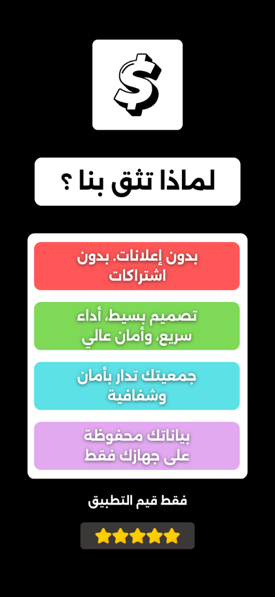
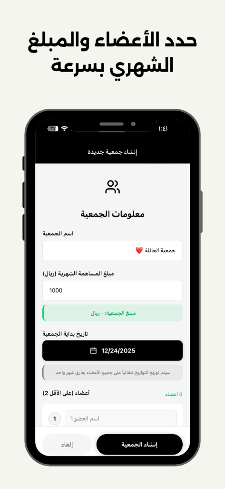

# SEO Documentation for MyCircle - جمعيتي App

## Complete SEO Package for MyCircle Application

---

## 1️⃣ Title Tags (العنوان الرئيسي للموقع)

### Arabic:
```
جمعيتي – تطبيق إدارة الجمعيات الشهرية بسهولة وأمان
```

### English:
```
MyCircle – Effortless and Secure Rotating Savings App
```

### Combined (Bilingual):
```
جمعيتي – تطبيق إدارة الجمعيات الشهرية بسهولة وأمان | MyCircle – Effortless and Secure Rotating Savings App
```

---

## 2️⃣ Meta Description (وصف قصير لمحركات البحث)

### Arabic:
```
تطبيق جمعيتي لإدارة الجمعيات المالية الدوّارة. أنشئ مجموعتك، تتبع المساهمات، اعرف دور كل عضو، بدون تسجيل دخول، بدون إعلانات، وبدون اشتراكات.
```

### English:
```
MyCircle app helps you manage rotating savings circles. Create your circle, track contributions, see each member's turn, no sign-up, no ads, no subscriptions.
```

### Combined (Bilingual):
```
تطبيق جمعيتي لإدارة الجمعيات المالية الدوّارة. أنشئ مجموعتك، تتبع المساهمات، اعرف دور كل عضو، بدون تسجيل دخول، بدون إعلانات، وبدون اشتراكات. MyCircle app helps you manage rotating savings circles. Create your circle, track contributions, see each member's turn, no sign-up, no ads, no subscriptions.
```

---

## 3️⃣ Meta Keywords (كلمات مفتاحية للبحث)

### Arabic:
```
جمعية, جمعيات مالية, جمعية شهرية, ادخار, توفير, تنظيم المال, إدارة الجمعية, تدوير المال, فلوس, مشاركة مالية
```

### English:
```
savings circle, rotating savings, money management, monthly contributions, finance, budget, money tracker, group savings, cash rotation
```

### Combined (Bilingual):
```
جمعية, جمعيات مالية, جمعية شهرية, ادخار, توفير, تنظيم المال, إدارة الجمعية, تدوير المال, فلوس, مشاركة مالية, savings circle, rotating savings, money management, monthly contributions, finance, budget, money tracker, group savings, cash rotation
```

---

## 4️⃣ Open Graph Tags (للمشاركة على وسائل التواصل)

### OG Title (Arabic):
```html
<meta property="og:title" content="جمعيتي – تطبيق إدارة الجمعيات الشهرية">
```

### OG Title (English):
```html
<meta property="og:title" content="MyCircle – Rotating Savings App">
```

### OG Title (Combined):
```html
<meta property="og:title" content="جمعيتي – تطبيق إدارة الجمعيات الشهرية | MyCircle – Rotating Savings App">
```

### OG Description (Arabic):
```html
<meta property="og:description" content="أنشئ مجموعتك، تابع المساهمات، واعرف دور كل عضو بسهولة وأمان.">
```

### OG Description (English):
```html
<meta property="og:description" content="Create your circle, track contributions, and see each member's turn easily and securely.">
```

### OG Image:
```html
<meta property="og:image" content="images/mycircle_icon.png">
```

### OG URL:
```html
<meta property="og:url" content="https://owida.com/mycircle.html">
```

### OG Type:
```html
<meta property="og:type" content="website">
```

---

## 5️⃣ H1 & H2 Tags (عناوين داخل الموقع)

### H1 (Main Heading):

**Arabic:**
```html
<h1>جمعيتي – تطبيق إدارة الجمعيات الشهرية</h1>
```

**English:**
```html
<h1>MyCircle – Rotating Savings Circle App</h1>
```

### H2 (Subheadings):

**Arabic:**
```html
<h2>لماذا تثق بتطبيق جمعيتي؟</h2>
<h2>مميزات التطبيق</h2>
<h2>كيف يعمل التطبيق؟</h2>
<h2>ابدأ مجموعتك الآن</h2>
```

**English:**
```html
<h2>Why trust MyCircle?</h2>
<h2>App Features</h2>
<h2>How the app works</h2>
<h2>Start your circle now</h2>
```

---

## 6️⃣ Schema.org Structured Data (بيانات منظمة)

```json
{
    "@context": "https://schema.org",
    "@type": "SoftwareApplication",
    "name": "MyCircle - جمعيتي",
    "applicationCategory": "FinanceApplication",
    "operatingSystem": "iOS",
    "offers": {
        "@type": "Offer",
        "price": "0",
        "priceCurrency": "USD"
    },
    "description": "تطبيق إدارة الجمعيات المالية الدوّارة بسهولة وأمان",
    "aggregateRating": {
        "@type": "AggregateRating",
        "ratingValue": "5.0",
        "ratingCount": "100"
    }
}
```

---

## 7️⃣ Complete HTML Head Section (قسم Head كامل)

```html
<head>
    <meta charset="UTF-8">
    <meta name="viewport" content="width=device-width, initial-scale=1.0">
    
    <!-- SEO Meta Tags -->
    <title>جمعيتي – تطبيق إدارة الجمعيات الشهرية بسهولة وأمان | MyCircle – Effortless and Secure Rotating Savings App</title>
    <meta name="description" content="تطبيق جمعيتي لإدارة الجمعيات المالية الدوّارة. أنشئ مجموعتك، تتبع المساهمات، اعرف دور كل عضو، بدون تسجيل دخول، بدون إعلانات، وبدون اشتراكات. MyCircle app helps you manage rotating savings circles.">
    <meta name="keywords" content="جمعية, جمعيات مالية, جمعية شهرية, ادخار, توفير, تنظيم المال, إدارة الجمعية, savings circle, rotating savings, money management, monthly contributions, finance">
    <meta name="author" content="OWIDA">
    
    <!-- Open Graph Meta Tags -->
    <meta property="og:title" content="جمعيتي – تطبيق إدارة الجمعيات الشهرية | MyCircle – Rotating Savings App">
    <meta property="og:description" content="أنشئ مجموعتك، تابع المساهمات، واعرف دور كل عضو بسهولة وأمان. Create your circle, track contributions, and see each member's turn easily and securely.">
    <meta property="og:type" content="website">
    <meta property="og:image" content="images/mycircle_icon.png">
    <meta property="og:url" content="https://owida.com/mycircle.html">
    
    <!-- Twitter Card Meta Tags -->
    <meta name="twitter:card" content="summary_large_image">
    <meta name="twitter:title" content="جمعيتي – MyCircle App">
    <meta name="twitter:description" content="تطبيق إدارة الجمعيات المالية بسهولة وأمان">
    <meta name="twitter:image" content="images/mycircle_icon.png">
    
    <!-- Canonical URL -->
    <link rel="canonical" href="https://owida.com/mycircle.html">
    
    <!-- Schema.org structured data -->
    <script type="application/ld+json">
    {
        "@context": "https://schema.org",
        "@type": "SoftwareApplication",
        "name": "MyCircle - جمعيتي",
        "applicationCategory": "FinanceApplication",
        "operatingSystem": "iOS",
        "offers": {
            "@type": "Offer",
            "price": "0",
            "priceCurrency": "USD"
        },
        "description": "تطبيق إدارة الجمعيات المالية الدوّارة بسهولة وأمان"
    }
    </script>
</head>
```

---

## 8️⃣ Call to Action (CTA) Text

### Arabic:
```
ابدأ مجموعتك الآن واستمتع بإدارة سهلة وآمنة لأموالك!
```
**Button Text:** `تحميل التطبيق` or `قريباً على App Store`

### English:
```
Start your circle now and enjoy easy, secure money management!
```
**Button Text:** `Download App` or `Coming Soon to App Store`

---

## 9️⃣ URL Structure (بنية الروابط)

### Main App Page:
```
https://owida.com/mycircle.html
```

### Privacy Policy:
```
https://owida.com/privacy.html#mycircle
```

### Support:
```
https://owida.com/support.html
```

---

## 🔟 Additional SEO Tips

### 1. **Alt Text for Images:**
```html



```

### 2. **Internal Linking:**
- Link from homepage to MyCircle page
- Link from MyCircle page to Privacy Policy
- Link from MyCircle page to Support page

### 3. **Mobile Optimization:**
- Ensure responsive design
- Fast loading times
- Touch-friendly buttons

### 4. **Page Speed:**
- Optimize images (compress PNG files)
- Minify CSS and JavaScript
- Use browser caching

### 5. **Content Quality:**
- Use clear, descriptive headings
- Include both Arabic and English content
- Add FAQ section if needed

---

## 📱 Social Media Sharing Preview

When shared on Facebook, Twitter, or WhatsApp, the link will display:

**Title:** جمعيتي – تطبيق إدارة الجمعيات الشهرية | MyCircle

**Description:** أنشئ مجموعتك، تابع المساهمات، واعرف دور كل عضو بسهولة وأمان

**Image:** MyCircle App Icon (Dollar Sign)

---

## ✅ Implementation Checklist

- [x] Title tag optimized
- [x] Meta description added
- [x] Meta keywords included
- [x] Open Graph tags configured
- [x] Schema.org structured data added
- [x] H1 and H2 tags properly structured
- [x] Alt text for all images
- [x] Canonical URL set
- [x] Mobile-responsive design
- [x] Fast loading speed
- [x] Internal linking established
- [x] Bilingual content (Arabic & English)

---

**Last Updated:** December 24, 2024  
**Created by:** OWIDA Development Team
